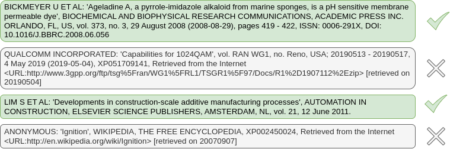

# references-tractor 🚜🖇️🧻🎓
References Tractor is a Python package designed to process raw citation texts and link them to scholarly knowledge graphs like OpenAlex, OpenAIRE, PubMed, CrossRef, and HAL. It leverages advanced natural language processing techniques powered by three small, fine-tuned language models to deliver accurate and robust citation parsing and linking.


## 🔨 Key steps of the tools:

Citation Parser follows a structured multi-step process to achieve accurate citation linking:

1. **Pre-Screening**: a classification model based on `distilbert/distilbert-base-multilingual-cased` determines whether the given text is a valid citation or not.

3. **Citation Parsing (NER)**: sophisticated Named Entity Recognition (NER) extracts key fields from the citation. The citation is parsed into structured fields using a fine-tuned Named Entity Recognition model. The extracted fields can include:
    - `TITLE`, `AUTHORS`, `VOLUME`, `ISSUE`, `YEAR`, `DOI`, `ISSN`, `ISBN`, `FIRST_PAGE`, `LAST_PAGE`, `JOURNAL`, and `EDITOR`.


3. **Candidate Identification**: a set of carefully crafted queries to the OpenAlex API retrieves one or more candidate publications based on the parsed citation fields. The parsed information is used to construct a series of queries to the OpenAlex API, retrieving one or more potential matches for the citation.
4. **Pairwise Classification**: a pairwise classification model predicts the likelihood of the identified candidates matching the original citation. This model is fine-tuned on a dataset of citation pairs in the format: `"CITATION 1 [SEP] CITATION 2"`. If multiple candidates are retrieved, the publication with the highest likelihood score is returned.

The best-matching candidate is selected based on the likelihood score and returned as the final linked publication.

## 💻 Installation

```bash
pip install git+https://github.com/sirisacademic/citation-parser.git
```

## 🚀 Usage
### 1. Basic Citation Linking
Here’s a basic example of how to use Citation Parser:

```python
from references_tractor import ReferencesTractor

# Initialize the parser
ref_tractor = ReferencesTractor()

# Raw citation text
citation = "MURAKAMI, H等: 'Unique thermal behavior of acrylic PSAs bearing long alkyl side groups and crosslinked by aluminum chelate', 《EUROPEAN POLYMER JOURNAL》"

# Parse and link the citation
result = ref_tractor.link_citation(citation, api_target = "openalex", output = 'simple')
```

The output would look like this:
```python
{'result': 'Hiroto Murakami, Keisuke Futashima, Minoru Nanchi, et al. (2010). Unique thermal behavior of acrylic PSAs bearing long alkyl side groups and crosslinked by aluminum chelate. European Polymer Journal, 47 (3) 378-384. doi: 10.1016/j.eurpolymj.2010.12.012',
 'score': 0.9697238802909851,
 'openalex_id': 'W2082866977',
 'doi': '10.1016/j.eurpolymj.2010.12.012',
 'url': 'https://openalex.org/W2082866977'}
```

### 2. Ensemble Linking Across Multiple APIs
```python
citation = "Kon Kam King, J., Granjou, C., Fournil, J. and Cécillon, L., 2018. Soil Sciences and the French 4 per 1000 Initiative - The promises of underground carbon, Energy Research and social sciences vol. 45, pp. 144-152"

result = ref_tractor.link_citation_ensemble(
    citation,
    output="simple",
    api_targets=["openalex", "hal", "openaire"]
)
```

The output would look like this:
```python
{'doi': '10.1016/j.erss.2018.06.024',
 'external_ids': {
        'openalex': 'W2857848549',
        'openaire': 'doi_dedup___::06daf67745e2c8d310c1effddb6240ab',
        'hal_id': 'hal-01832903'}}
```
### 3. Extract and Link Citations from Raw Text
```python
text = '''Our main publications are the following:
- Ibba M, Söll D (May 2001). "The renaissance of aminoacyl-tRNA synthesis". EMBO Reports. 2 (5): 382–7. doi:10.1093/embo-reports/kve095. PMC 1083889. PMID 11375928. Archived from the original on 1 May 2011.
- Lengyel P, Söll D (June 1969). "Mechanism of protein biosynthesis". Bacteriological Reviews. 33 (2): 264–301. doi:10.1128/MMBR.33.2.264-301.1969. PMC 378322. PMID 4896351.
- Rudolph FB (January 1994). "The biochemistry and physiology of nucleotides". The Journal of Nutrition. 124 (1 Suppl): 124S – 127S. doi:10.1093/jn/124.suppl_1.124S. PMID 8283301. Zrenner R, Stitt M, Sonnewald U, Boldt R (2006). "Pyrimidine and purine biosynthesis and degradation in plants". Annual Review of Plant Biology. 57: 805–36. doi:10.1146/annurev.arplant.57.032905.105421. PMID 16669783.
- Stasolla C, Katahira R, Thorpe TA, Ashihara H (November 2003). "Purine and pyrimidine nucleotide metabolism in higher plants". Journal of Plant Physiology. 160 (11): 1271–95. Bibcode:2003JPPhy.160.1271S. doi:10.1078/0176-1617-01169. PMID 14658380.'''

linked = ref_tractor.extract_and_link_from_text(text, api_target="openalex")
```

The output would look like:
```python
{'Ibba M, Söll D (May 2001). "The renaissance of aminoacyl-tRNA synthesis". EMBO Reports. 2 (5): 382–7. doi:10.1093/embo-reports/kve095. PMC 1083889. PMID 11375928': {'result': 'Michael Ibba, Dieter Söll (2001). The renaissance of aminoacyl‐tRNA synthesis. EMBO Reports, 2 (5) 382-387. doi: 10.1093/embo-reports/kve095',
  'score': 0.9820373058319092,
  'openalex_id': 'W1983918957',
  'doi': '10.1093/embo-reports/kve095',
  'url': 'https://openalex.org/W1983918957'},
 'Lengyel P, Söll D (June 1969). "Mechanism of protein biosynthesis". Bacteriological Reviews. 33 (2): 264–301. doi:10.1128/MMBR.33.2.264-301.1969. PMC 378322. PMID 4896351': {'result': 'P Lengyel, D Söll (1969). Mechanism of protein biosynthesis. Bacteriological Reviews, 33 (2) 264-301. doi: 10.1128/br.33.2.264-301.1969',
  'score': 0.9824202060699463,
  'openalex_id': 'W2099131547',
  'doi': '10.1128/br.33.2.264-301.1969',
  'url': 'https://openalex.org/W2099131547'},
 'Rudolph FB (January 1994). "The biochemistry and physiology of nucleotides". The Journal of Nutrition. 124 (1 Suppl): 124S – 127S. doi:10.1093/jn/124.suppl_1.124S. PMID 8283301': {'result': 'Frederick B Rudolph (1994). The Biochemistry and Physiology of Nucleotides. Journal of Nutrition, 124 (13) 124S-127S. doi: 10.1093/jn/124.suppl_1.124s',
  'score': 0.9554430246353149,
  'openalex_id': 'W1592790847',
  'doi': '10.1093/jn/124.suppl_1.124s',
  'url': 'https://openalex.org/W1592790847'},
 ' Zrenner R, Stitt M, Sonnewald U, Boldt R (2006). "Pyrimidine and purine biosynthesis and degradation in plants". Annual Review of Plant Biology. 57: 805–36. doi:10.1146/annurev.arplant.57.032905.105421. PMID 16669783': {'result': 'Rita Zrenner, Mark Stitt, Uwe Sonnewald, et al. (2006). PYRIMIDINE AND PURINE BIOSYNTHESIS AND DEGRADATION IN PLANTS. Annual Review of Plant Biology, 57 (1) 805-836. doi: 10.1146/annurev.arplant.57.032905.105421',
  'score': 0.9787797331809998,
  'openalex_id': 'W2128896661',
  'doi': '10.1146/annurev.arplant.57.032905.105421',
  'url': 'https://openalex.org/W2128896661'},
 'Stasolla C, Katahira R, Thorpe TA, Ashihara H (November 2003). "Purine and pyrimidine nucleotide metabolism in higher plants". Journal of Plant Physiology. 160 (11): 1271–95. Bibcode:2003JPPhy.160.1271S. doi:10.1078/0176-1617-01169. PMID 14658380': {'result': 'Claudio Stasolla, Riko Katahira, Trevor A. Thorpe, et al. (2003). Purine and pyrimidine nucleotide metabolism in higher plants. Journal of Plant Physiology, 160 (11) 1271-1295. doi: 10.1078/0176-1617-01169',
  'score': 0.9806508421897888,
  'openalex_id': 'W2031211089',
  'doi': '10.1078/0176-1617-01169',
  'url': 'https://openalex.org/W2031211089'}}
```

### 4. Access Results of Individual Pipeline Steps
For advanced users who need to inspect intermediate results or use individual components in custom workflows:

```python
from references_tractor import ReferencesTractor

# Initialize the parser
ref_tractor = ReferencesTractor()

citation = "Smith, J. (2023). Machine Learning in Practice. Nature, 123, 456-789."

# Step 1: Validate if text is a citation
prescreening_result = ref_tractor.prescreening_pipeline(citation)[0]
is_citation = prescreening_result["label"] == "True"
confidence = prescreening_result.get("score", 0)
print(f"Is citation: {is_citation} (confidence: {confidence:.3f})")

if is_citation:
    # Step 2: Extract named entities
    entities = ref_tractor.process_ner_entities(citation)
    print(f"Extracted entities: {entities}")
    # Output: {'AUTHORS': ['Smith, J.'], 'YEAR': ['2023'], 'TITLE': ['Machine Learning in Practice'], ...}
    
    # Step 3: Search for candidates
    candidates = ref_tractor.search_api(entities, api="openalex")
    print(f"Found {len(candidates)} candidates")
    
    # Step 4: Format and score candidates
    if candidates:
        formatted_citations = [
            ref_tractor.generate_apa_citation(pub, api="openalex") 
            for pub in candidates
        ]
        
        scores = [
            ref_tractor.select_pipeline(f"{citation} [SEP] {formatted_cit}")[0]
            for formatted_cit in formatted_citations
        ]
        
        # Find best match
        best_idx = max(range(len(scores)), key=lambda i: scores[i].get('score', 0))
        print(f"Best match: {formatted_citations[best_idx]}")
        print(f"Confidence: {scores[best_idx].get('score', 0):.3f}")
```

This approach allows you to:
- **Debug citation linking issues** by inspecting each step
- **Use NER models for other applications** (e.g., bibliography analysis)
- **Implement custom search strategies** using extracted entities
- **Build hybrid workflows** combining your logic with our models

## ⚙️ Functions and Parameters

### 🧠 Available Functions

> `link_citation(citation: str, api_target: str, output: str = 'simple')`: 
Links a single citation string to a publication in the selected API.

> `link_citation_ensemble(citation: str, output: str = 'simple', api_targets: list)`: Queries multiple APIs, performs majority voting among returned DOIs, and returns the most  agreed-upon match.

> `extract_and_link_from_text(text: str, api_target: str)`: Scans an entire text body to detect and extract citation spans using a built-in citation span detector. Each detected citation is then parsed and linked to the selected scholarly database.

### Common Parameters Across Methods

- **api_target**: Specifcy knowledge graphs to query. Options include:
    - `openalex` - [*default*] Links to OpenAlex
    - `openaire` - Links to OpenAIRE
    - `pubmed` - Links to PubMed
    - `hal` - Links to HAL
    - `crossref` - Links to CrossRef
- **output**: Specifies the type of result returned:
    - `simple` – Returns a concise, structured citation match.
    - `full` – Returns a detailed, full citation with additional metadata.
- **device**:
    - `cpu`: Utilises the CPU for model inference, suitable for environments without GPU support. Recommended for smaller workloads or when GPU is unavailable.
    - `cuda`: Utilises GPUs via CUDA for faster inference. Recommended for environments where GPUs are available and high performance is required.

### Returns
- result: *dict* with the folling attributues:
    - `result`: Citation from the linked source.
    - `score`: Similarity score with the input citatio
    - `id`: `publication_id` in the target Scholarly Knowledge Graph (OpenAlex, OpenAIRE, or PubMed)
    - (if `output='full'`) `full-publication`: Publication object from the target API

## Dependencies

Ensure you have all necessary dependencies installed. You can install them using the following command:

```bash
pip install -r requirements.txt
```

## Applications

Citation Parser is ideal for:
- Automated metadata enrichment: extract structured metadata from raw citation texts.
- Citation Validation: verify the correctness of citations in manuscripts.
- Scholarly Database Integration: link citations to knowledge graphs like OpenAlex and OpenAIRE.

## Models
- 🤗 **TYPE model available at: https://huggingface.co/SIRIS-Lab/citation-parser-TYPE**
- 🤗 **NER model available at: https://huggingface.co/SIRIS-Lab/citation-parser-ENTITY**
- 🤗 **SELECT model available at: https://huggingface.co/SIRIS-Lab/citation-parser-SELECT**

### 📊 Model Performance Metrics
The performance of each model used in the Citation Parser is evaluated using the F1 score. Below are the F1 scores for each of the key models involved in citation parsing and linking:

| Model            | F1 Score |
|---------------------|----------|
| **TYPE Model (Citation Pre-screening)**  | 0.941638 |
| **NER Model (Citation Citation)**  | 0.949772 |
 **SELECT Model (Candidate Selection)**  | 0.846972 |

# Future features
- Improved candidate retrieval: advanced query strategies for ambiguous or incomplete citations.
- Translation to multilingual input to do multiple searches in both input language and English

## 📫 Contact

For further information, please contact <nicolau.duransilva@sirisacademic.com>.

## ⚖️ License

This work is distributed under a [Apache License, Version 2.0](https://www.apache.org/licenses/LICENSE-2.0).
