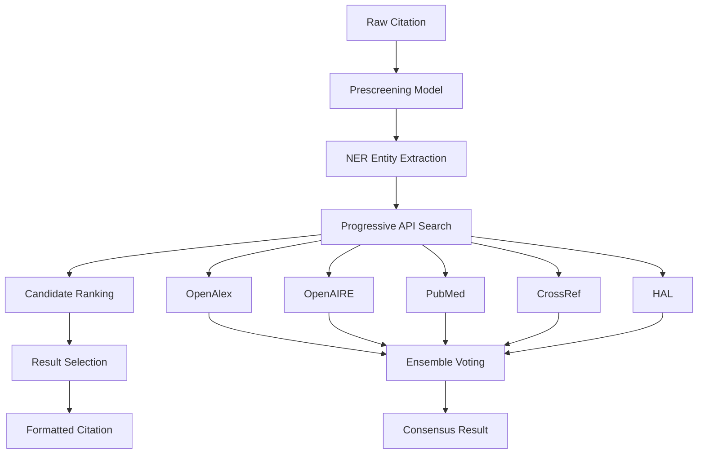

# References Tractor


A comprehensive citation processing and linking system that extracts structured information from raw citation text and links citations to scholarly publications across multiple academic databases.

[](https://badge.fury.io/py/references-tractor)
[](https://www.python.org/downloads/)
[](https://opensource.org/licenses/Apache-2.0)
[](https://github.com/sirisacademic/references-tractor/actions)

## 📑 Table of Contents

- [🚀 Features](#-features)
- [📊 System Architecture](#-system-architecture)
- [🚀 Quick Start](#-quick-start)
  - [Installation](#installation)
  - [Basic Usage](#basic-usage)
  - [Ensemble Linking](#ensemble-linking)
  - [Batch Text Processing](#batch-text-processing)
- [🔧 Supported APIs](#-supported-apis)
- [⚙️ Configuration](#️-configuration)
  - [Device Selection](#device-selection)
  - [Caching Configuration](#caching-configuration)
  - [Custom Model Paths](#custom-model-paths)
- [📈 Evaluation System](#-evaluation-system)
  - [Running Evaluations](#running-evaluations)
  - [Evaluation Metrics](#evaluation-metrics)
  - [Output Files](#output-files)
- [🤖 Models](#-models)
- [🎛️ API Reference](#️-api-reference)
  - [Core Methods](#core-methods)
- [📋 Output Formats](#-output-formats)
  - [Simple Output](#simple-output)
  - [Advanced Output](#advanced-output)
  - [Ensemble Output](#ensemble-output)
- [🔧 Performance Considerations](#-performance-considerations)
  - [Hardware Requirements](#hardware-requirements)
  - [Optimization Tips](#optimization-tips)
- [📚 Documentation](#-documentation)
- [🤝 Contributing](#-contributing)
- [📄 License](#-license)
- [📖 Citation](#-citation)
- [🆘 Support](#-support)
- [🙏 Acknowledgments](#-acknowledgments)

## 🚀 Features

- **Multi-API Citation Linking**: Search across OpenAlex, OpenAIRE, PubMed, CrossRef, and HAL
- **Advanced NER Processing**: Extract citation entities using transformer-based models
- **Intelligent Candidate Ranking**: SELECT model for citation matching with confidence scoring
- **Ensemble Method**: Consensus-based linking using multiple APIs with DOI voting
- **Progressive Search Strategy**: Adaptive search from restrictive to broad field combinations
- **Multiple DOI Support**: Handle publications with conference and journal versions
- **Comprehensive Evaluation**: Classification metrics with detailed performance analysis
- **Caching System**: Reduce duplicate API calls and improve performance
- **Device Flexibility**: Auto-detection and support for CPU, CUDA, and Apple Silicon (MPS)

## 📊 System Architecture



## 🚀 Quick Start

### Installation

#### Standard Installation
```bash
pip install references-tractor
```

#### Development Installation
```bash
# Clone the repository
git clone https://github.com/sirisacademic/references-tractor.git
cd references-tractor

# Install dependencies
pip install -r requirements.txt

# Install the package
pip install -e .
```

#### Optional Dependencies
```bash
# For evaluation and analysis
pip install -e .[evaluation]

# For development tools
pip install -e .[dev]

# For performance optimization
pip install -e .[performance]
```

### Basic Usage

```python
from references_tractor import ReferencesTractor

# Initialize the pipeline
ref_tractor = ReferencesTractor()

# Link a single citation
citation = "Smith, J. et al. Machine Learning in Healthcare. Nature Medicine 25:1234-1240, 2019."
result = ref_tractor.link_citation(citation, api_target="openalex")

print(f"Found: {result.get('result', 'No match')}")
print(f"DOI: {result.get('doi', 'N/A')}")
print(f"Confidence: {result.get('score', 'N/A')}")
```

### Ensemble Linking

```python
# Use multiple APIs for robust linking
ensemble_result = ref_tractor.link_citation_ensemble(citation)

print(f"Consensus DOI: {ensemble_result.get('doi', 'No consensus')}")
print(f"External IDs: {ensemble_result.get('external_ids', {})}")
```

### Batch Text Processing

```python
# Extract and link citations from text
text = """
Recent studies have shown promising results (Smith et al., Nature Medicine, 2019).
The methodology follows established protocols (Johnson, Science, 2020).
"""

linked_citations = ref_tractor.extract_and_link_from_text(text)
for citation, result in linked_citations.items():
    print(f"Citation: {citation}")
    print(f"Linked to: {result.get('result', 'No match')}")
```

## 🔧 Supported APIs

| API | Coverage | Specialization | Website |
|-----|----------|----------------|---------|
| **OpenAlex** | Comprehensive academic literature | General scholarly content | [openalex.org](https://openalex.org) |
| **OpenAIRE** | European research infrastructure | Open access publications | [openaire.eu](https://www.openaire.eu) |
| **PubMed** | Biomedical literature | Life sciences and medicine | [pubmed.ncbi.nlm.nih.gov](https://pubmed.ncbi.nlm.nih.gov) |
| **CrossRef** | DOI registry | Published academic content | [crossref.org](https://www.crossref.org) |
| **HAL** | French open archive | French research publications | [hal.science](https://hal.science) |

## ⚙️ Configuration

### Device Selection

```python
# Auto-detect best available device
ref_tractor = ReferencesTractor(device="auto")

# Force specific device
ref_tractor = ReferencesTractor(device="cuda")  # GPU
ref_tractor = ReferencesTractor(device="cpu")   # CPU only
ref_tractor = ReferencesTractor(device="mps")   # Apple Silicon
```

### Caching Configuration

```python
# Configure caching behavior
ref_tractor = ReferencesTractor(
    enable_caching=True,
    cache_size_limit=1000
)

# Check cache performance
stats = ref_tractor.get_cache_stats()
print(f"Cache hit rate: {stats['hit_rate']}")
```

### Custom Model Paths

```python
# Use custom model locations
ref_tractor = ReferencesTractor(
    ner_model_path="path/to/custom/ner/model",
    select_model_path="path/to/custom/select/model"
)
```

## 📈 Evaluation System

Comprehensive evaluation framework for testing citation linking performance.

### Running Evaluations

```bash
# Basic evaluation
python evaluation/evaluate_citations.py

# Limited test run
python evaluation/evaluate_citations.py --limit 5

# Custom configuration
python evaluation/evaluate_citations.py \
    --gold-standard my_test.json \
    --output-dir results/ \
    --evaluation-mode loose \
    --device auto
```

### Evaluation Metrics

The system provides detailed classification metrics:

- **Accuracy**: Overall correctness percentage
- **Correct Matches**: Citations correctly linked to expected results
- **Correct No Result**: Citations that correctly returned no match
- **Incorrect Matches**: Wrong links when correct link expected
- **Incorrect Missing**: No result when correct link expected
- **Incorrect Spurious**: Unexpected result when no link expected

### Output Files

- `01_summary_dashboard_*.txt`: Executive summary with comprehensive metrics
- `02_accuracy_metrics_*.tsv`: Detailed accuracy breakdown
- `03_comparison_table_*.tsv`: Gold standard vs. results comparison
- `04_*_detailed_*.tsv`: Individual API performance details
- `05_results_*.json`: Complete evaluation data

**📖 For detailed evaluation documentation, see [docs/evaluation.md](docs/evaluation.md)**

## 🤖 Models

The system uses specialized transformer models:

- **NER Model**: `SIRIS-Lab/citation-parser-ENTITY` - Extract citation entities
- **SELECT Model**: `SIRIS-Lab/citation-parser-SELECT` - Rank citation candidates
- **Prescreening Model**: `SIRIS-Lab/citation-parser-TYPE` - Filter valid citations
- **Span Model**: `SIRIS-Lab/citation-parser-SPAN` - Extract citation spans from text

## 🎛️ API Reference

### Core Methods

#### `link_citation(citation, api_target='openalex', output='simple')`

Link a single citation to a publication.

**Parameters:**
- `citation` (str): Raw citation text
- `api_target` (str): Target API ('openalex', 'openaire', 'pubmed', 'crossref', 'hal')
- `output` (str): Output detail level ('simple', 'advanced')

#### `link_citation_ensemble(citation, api_targets=None, output='simple')`

Link citation using ensemble method with multiple APIs.

#### `extract_and_link_from_text(text, api_target='openalex')`

Extract citations from text and link them.

#### `process_ner_entities(citation)`

Extract named entities from citation text.

**📖 For complete API documentation, see [docs/api.md](docs/api.md)**

## 📋 Output Formats

### Simple Output

```python
{
    "result": "Smith, J. et al. (2019). Machine Learning in Healthcare. Nature Medicine, 25, 1234-1240. DOI: 10.1038/s41591-019-0123-4",
    "score": 0.95,
    "openalex_id": "W2963456789",
    "doi": "10.1038/s41591-019-0123-4",
    "url": "https://openalex.org/W2963456789"
}
```

### Advanced Output

```python
{
    "result": "Smith, J. et al. (2019). Machine Learning in Healthcare...",
    "score": 0.95,
    "openalex_id": "W2963456789",
    "doi": "10.1038/s41591-019-0123-4",
    "main_doi": "10.1038/s41591-019-0123-4",
    "alternative_dois": ["10.1101/2019.123456"],
    "total_dois": 2,
    "all_dois": ["10.1038/s41591-019-0123-4", "10.1101/2019.123456"],
    "url": "https://openalex.org/W2963456789",
    "full-publication": { /* Complete metadata */ }
}
```

### Ensemble Output

```python
{
    "doi": "10.1038/s41591-019-0123-4",
    "external_ids": {
        "openalex_id": "W2963456789",
        "pubmed_id": "31234567",
        "crossref_id": "10.1038/s41591-019-0123-4"
    },
    "ensemble_metadata": {
        "selected_doi_votes": 3,
        "total_dois_found": 1,
        "contributing_apis": ["openalex", "pubmed", "crossref"],
        "doi_vote_breakdown": {"10.1038/s41591-019-0123-4": 3}
    }
}
```

## 🔧 Performance Considerations

### Hardware Requirements

- **Minimum**: 4GB RAM, CPU-only operation supported
- **Recommended**: 8GB+ RAM, CUDA-compatible GPU for optimal performance
- **Apple Silicon**: Native MPS support for M1/M2 Macs

### Optimization Tips

- Use `device="auto"` for automatic hardware detection
- Enable caching for repeated evaluations
- Use `limit` parameter for testing and development
- Consider GPU acceleration for large-scale processing

## 📚 Documentation

| Document | Description |
|----------|-------------|
| **[API Reference](docs/api.md)** | Complete API documentation with examples |
| **[Evaluation System](docs/evaluation.md)** | Comprehensive evaluation framework and metrics |
| **[Development Examples](docs/examples.md)** | Detailed examples for extending the system |
| **[Contributing Guide](docs/contribute.md)** | Development setup and contribution guidelines |

## 🤝 Contributing

We welcome contributions! Please see our [Contributing Guidelines](docs/contribute.md) for details on:

- Code style and standards
- Testing requirements
- Pull request process
- Development setup

**📖 For detailed examples of extending the system, see [docs/examples.md](docs/examples.md)**

## 📄 License

This project is licensed under the Apache License 2.0 - see the [LICENSE](LICENSE) file for details.

## 📖 Citation

If you use this software in your research, please cite:

```bibtex
@software{references_tractor,
  title={References Tractor: Citation Processing and Linking System},
  author={Duran-Silva, Nicolau and Accuosto, Pablo and Cortini, Ruggero},
  year={2024},
  publisher={SIRIS Lab},
  url={https://github.com/sirisacademic/references-tractor}
}
```

## 🆘 Support

- **Issues**: [GitHub Issues](https://github.com/sirisacademic/references-tractor/issues)
- **Discussions**: [GitHub Discussions](https://github.com/sirisacademic/references-tractor/discussions)

## 🙏 Acknowledgments

- SIRIS Academic for project support
- Hugging Face for transformer infrastructure
- Academic database providers for API access